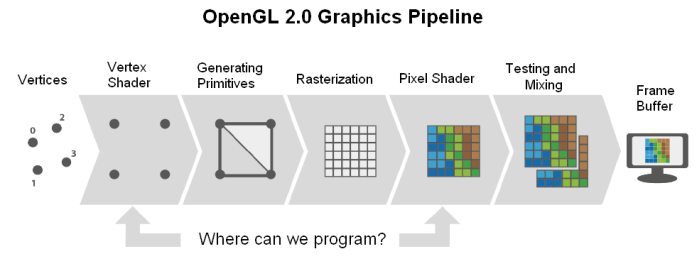
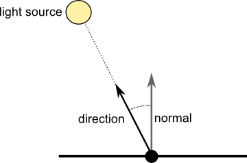

<section id="themes">
	<h2>Themes</h2>
		<p>
			Set your presentation theme: <br>
			<!-- Hacks to swap themes after the page has loaded. Not flexible and only intended for the reveal.js demo deck. -->
			<a href="#" onclick="document.getElementById('theme').setAttribute('href','css/theme/black.css'); return false;">Black (default)</a> -
			<a href="#" onclick="document.getElementById('theme').setAttribute('href','css/theme/white.css'); return false;">White</a> -
			<a href="#" onclick="document.getElementById('theme').setAttribute('href','css/theme/league.css'); return false;">League</a> -
			<a href="#" onclick="document.getElementById('theme').setAttribute('href','css/theme/sky.css'); return false;">Sky</a> -
			<a href="#" onclick="document.getElementById('theme').setAttribute('href','css/theme/beige.css'); return false;">Beige</a> -
			<a href="#" onclick="document.getElementById('theme').setAttribute('href','css/theme/simple.css'); return false;">Simple</a> <br>
			<a href="#" onclick="document.getElementById('theme').setAttribute('href','css/theme/serif.css'); return false;">Serif</a> -
			<a href="#" onclick="document.getElementById('theme').setAttribute('href','css/theme/night.css'); return false;">Night</a> -
			<a href="#" onclick="document.getElementById('theme').setAttribute('href','css/theme/moon.css'); return false;">Moon</a> -
			<a href="#" onclick="document.getElementById('theme').setAttribute('href','css/theme/solarized.css'); return false;">Solarized</a>
		</p>
</section>

H:

# Shaders

Andres Gomez and Jean Pierre Charalambos

H:

## Contents

1. Intro <!-- .element: class="fragment" data-fragment-index="1"-->
1. What's a shader <!-- .element: class="fragment" data-fragment-index="2"-->
1. Basic uses <!-- .element: class="fragment" data-fragment-index="3"-->
1. ShaderBase <!-- .element: class="fragment" data-fragment-index="4"-->

H:

## Introduction
### Keys in future game development

<section>
	<iframe width="420" height="345" src="http://www.youtube.com/embed/EpAHIutTE60"></iframe>
</section>

Excerpt from [A Brief History of Graphics](https://www.youtube.com/playlist?list=PLOQZmjD6P2HlOoEVKOPaCFvLnjP865X1f)

V:

## Introduction

Example

H:

## What is a shader?

A shader is a program that runs on the GPU and generates the output we see on the screen based on the scene information provided by our application

V:

## What is a shader?
### Graphics pipeline shaders



V:

## What is a shader?
### How are the shaders executed by the GPU?

The vertex shader is run on *each vertex* sent from the sketch:

```python
for vertex in geometry:
    vertex_shader(vertex)
```

The fragment shader is run on *each pixel* covered by the geometry in our sketch:

```python
for pixel in screen:
    if covered_by_geometry(pixel):
        ouptut_color = fragment_shader(pixel)
```

V:

## What is a shader?
### Variable types in a shader

<li class="fragment">Uniform variables are those that remain constant for each vertex in the scene, for example the projection and modelview matrices</li>
<li class="fragment">Attribute variables are defined per each vertex, for example the position, normal, and color</li>
<li class="fragment">The varying variables connect the different stages in the shader</li>

V: 

## What is a shader?
### Languages

<li class="fragment"> [Cg](https://developer.nvidia.com/cg-toolkit) </li>
<li class="fragment"> [HLSL](http://en.wikipedia.org/wiki/High-Level_Shading_Language) </li>
<li class="fragment"> [GLSL](https://www.opengl.org/documentation/glsl/) -> [OpenGL](https://www.opengl.org/) </li>

V: 

## What is a shader?
#### Just Cause 2 visualization, by Jim Blackhurst

<iframe width="854" height="510" src="//www.youtube.com/embed/hEoxaGkNcrg" frameborder="0" allowfullscreen></iframe>

V:

## What is a shader?
#### Generating Utopia, by Stefan Wagner

<iframe src="//player.vimeo.com/video/74066023" width="854" height="510" frameborder="0" webkitallowfullscreen mozallowfullscreen allowfullscreen></iframe>

V:

## What is a shader?
#### Video portraits, by Sergio Albiac

<iframe src="//player.vimeo.com/video/32760578" width="854" height="510" frameborder="0" webkitallowfullscreen mozallowfullscreen allowfullscreen></iframe>

V:

## What is a shader?
#### Unnamed soundsculpture, by Daniel Franke

<iframe src="//player.vimeo.com/video/38840688" width="854" height="510" frameborder="0" webkitallowfullscreen mozallowfullscreen allowfullscreen></iframe>

V:

## What is a shader?
### OpenGL Resources

<li class="fragment"> [Tutorials](http://ogldev.atspace.co.uk/) </li>
<li class="fragment"> [Forums](https://www.opengl.org/discussion_boards/forum.php) </li>
<li class="fragment"> [Books](http://www.amazon.com/OpenGL-Shading-Language-3rd-Edition/dp/0321637631/ref=sr_1_1?) </li>
<li class="fragment"> [Sandboxes](http://glslsandbox.com/) </li>

H:

## Basic uses

1. Image filters
2. Lighting
3. Lighting & Texturing

V:

## Basic uses
### Image filters: B & W

<li class="fragment"> Read the texture pixel (also called as *texel*) at the position determined by the texture coordinate </li>
<li class="fragment"> Calculate the luminance of the texel </li>
<li class="fragment"> If the luminance is above of below the 0.5 threshold, we output either white or black </li>

V:

## Basic uses
### Image filters: B & W


V:

## Basic uses
### Image filters: convolution

<font size=5>
<table>
<tr>
	<td colspan=2>Edge detection</td>

</tr>
<tr>
	<td>

	</td>
	<td>
$ K=\begin{bmatrix} 
0 & 1 & 0 \cr 
1 & -4 & 1 \cr 
0 & 1 & 0 \end{bmatrix} $
	</td>
</tr>
</table>
</font>

V:

## Basic uses
### Image filters: [Emboss](http://en.wikipedia.org/wiki/Image_embossing)

Replace each pixel of an image by a highlight or a shadow, depending on light/dark boundaries on the original image

The filtered image will represent the rate of color change at each location of the original image <!-- .element: class="fragment" data-fragment-index="1"-->

N:

Applying an embossing filter to an image often results in an image resembling a paper or metal embossing of the original image, hence the name.

V:

## Basic uses
### Image filters: [Emboss](http://en.wikipedia.org/wiki/Image_embossing)


V:

## Basic uses
### Image filters: [Edge detection](http://en.wikipedia.org/wiki/Edge_detection)

Identify points at which the image brightness changes sharply or has discontinuities

V:

## Basic uses
### Image filters: [Edge detection](http://en.wikipedia.org/wiki/Edge_detection)


V:

## Basic uses
### Lighting

In the simplest model of lighting, the intensity at each vertex is computed as the dot product between the vertex normal and the direction vector between the vertex and light positions. This model represents a point light source that emits light equally in all directions: 



V:

## Basic uses
### Lighting: toon shader

<li class="fragment"> [Toon shading](http://en.wikipedia.org/wiki/Cel_shading) (or cell shading) makes 3-D computer graphics appear to be flat </li>
<li class="fragment"> It is a type of non-photorealistic rendering </li>
<li class="fragment"> It uses less shading colors instead of a shade gradient or tints and shades </li>
<li class="fragment"> Used to mimic the style of a comic book or cartoon </li>

V:

## Basic uses
### Lighting: toon shader


V:

## Basic uses
### Lighting & Texturing

In order to render a scene with both lights and textures, the shaders simply need to incorporate the corresponding lighting math and the texture sampling

V:

## Basic uses
### Lighting & Texturing


H:

## ShaderBase